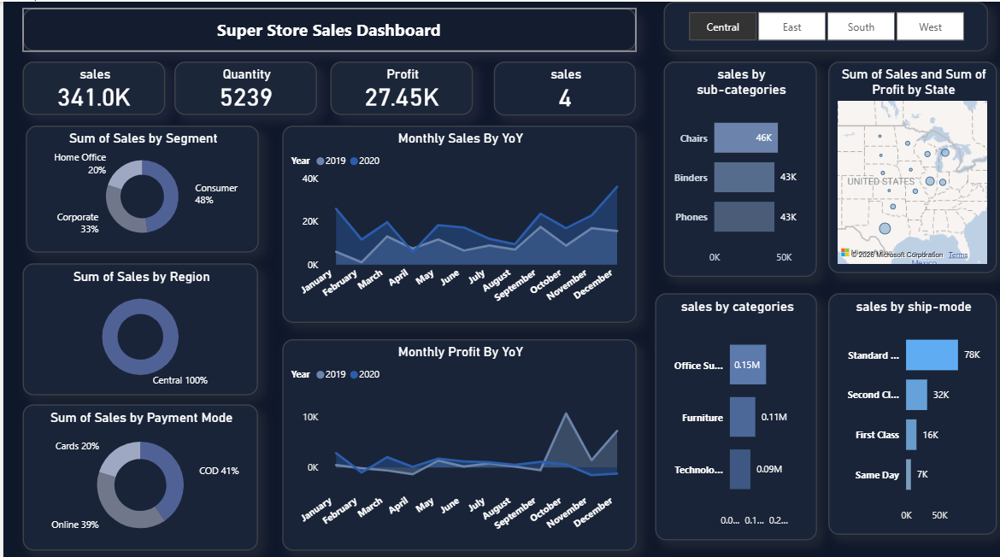
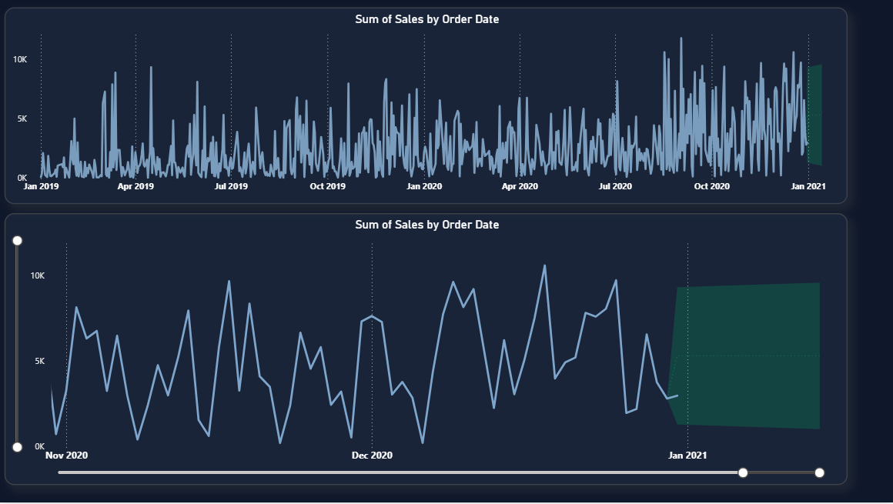
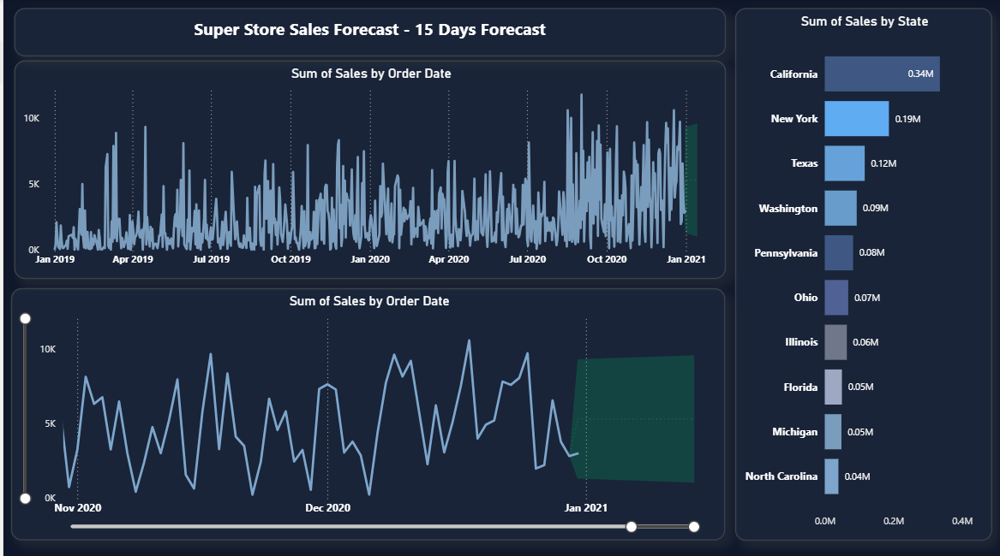

# 📊 Super Store Sales Dashboard

An interactive **Power BI** dashboard that analyzes and visualizes sales, profit, and quantity data for a retail superstore, including a 15-day sales forecast.

---

## 📁 Project Files

| Filee | Description |
|---|---|
| `Superstore_sales_dashboard.pbix` | The main Power BI report file containing all pages, visuals, and DAX measures |
| `SuperStore_Sales_Dataset.csv` | The raw sales dataset used as the data source (~5,900 rows) |

---

## 🧾 Dataset Overview

The dataset contains order-level retail sales records with the following fields:

- **Order Info:** Order ID, Order Date, Ship Date, Ship Mode
- **Customer Info:** Customer ID, Customer Name, Segment
- **Location:** Country, City, State, Region
- **Product Info:** Product ID, Category, Sub-Category, Product Name
- **Metrics:** Sales, Quantity, Profit, Returns
- **Other:** Payment Mode

---

## 📈 Dashboard Pages

### 1. Main Dashboard
An overview page with key metrics and regional filters:
- **KPI Cards:** Total Sales, Total Quantity, Total Profit
- **Sum of Sales by Segment** (donut chart – Consumer, Corporate, Home Office)
- **Sum of Sales by Region** (donut chart – Central, East, South, West)
- **Sum of Sales by Payment Mode** (donut chart – Cards, COD, Online)
- **Monthly Sales by Year-over-Year (YoY)** comparison
- **Monthly Profit by Year-over-Year (YoY)** comparison
- **Sales by Sub-Categories** and **Sales by Categories** (bar charts)
- **Sales by Ship Mode** (bar chart)
- **Sum of Sales and Profit by State** (map visual)
- Interactive **Region slicer** buttons (Central / East / South / West)

### 2. Sales Forecast Page
- **15-Day Sales Forecast** using Power BI's built-in forecasting (analytics pane)
- Full historical trend of **Sum of Sales by Order Date** (Jan 2019 – Jan 2021)
- Zoomed-in view with a date range slider (Nov 2020 – Jan 2021) showing the forecasted trend band
- **Sum of Sales by State** ranked bar chart (Top 10 states)

---

## 🛠️ Tools & Techniques Used

- **Power BI Desktop** for data modeling and visualization
- **Power Query** for data cleaning and transformation
- **DAX** for calculated measures (Sales, Profit, Quantity totals)
- **Power BI Forecasting (Analytics pane)** for the 15-day sales prediction
- **Bookmarks / Slicers** for interactive filtering by region

---

## 🚀 How to Use

1. Download `Superstore_sales_dashboard.pbix`
2. Open it with **Power BI Desktop** (free download from Microsoft)
3. Explore the dashboard pages using the tabs at the bottom
4. Use the Region buttons and slicers to filter the data interactively

---

## 🖼️ Preview

The project includes dashboard screenshots showing:
- The main KPI dashboard with regional breakdown
- The 15-day sales forecast chart
- The zoomed-in forecast trend with sales by state

---

## 📌 Key Insights

- **California** leads in total sales among all states, followed by New York and Texas
- **Consumer** segment contributes the largest share of sales (48%)
- **Standard Class** is the most used shipping mode
- **Office Supplies** category generates the highest sales among all categories
- Sales show a clear seasonal upward trend heading into Q4/Q1

---
## Dashboard Preview

### Main Dashboard

### Forecast Overview

### Sales Forecast + Top States

--------- 
## 👤 Created by

**Ebraam Saber**

- GitHub: https://github.com/EbraamSaber

- LinkedIn: https://www.linkedin.com/in/ebraam-saber 

